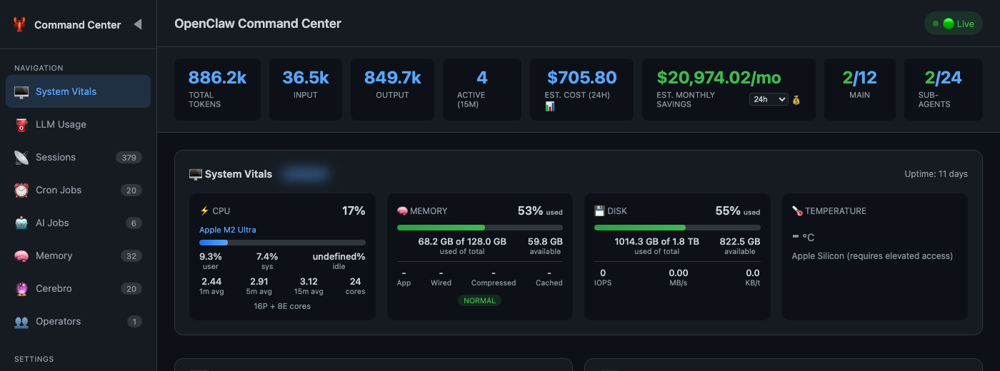
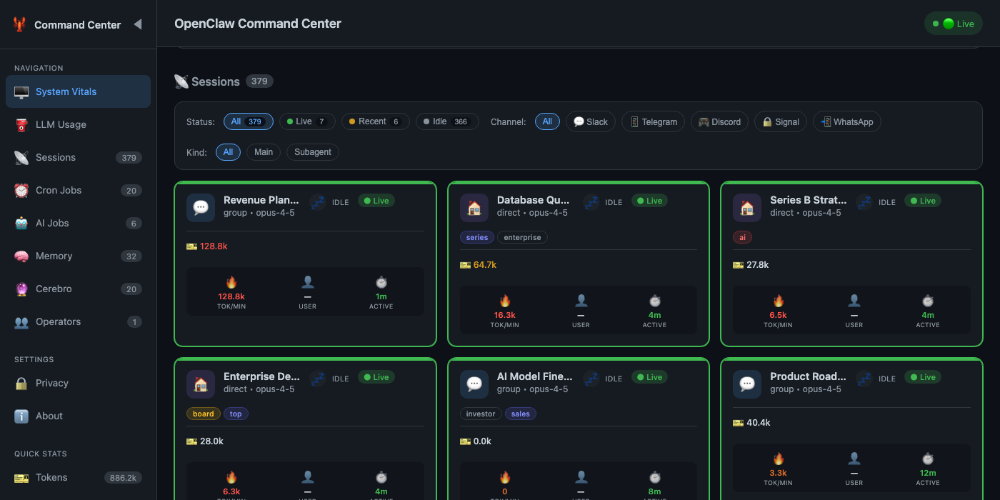
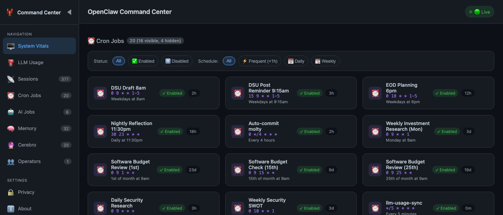
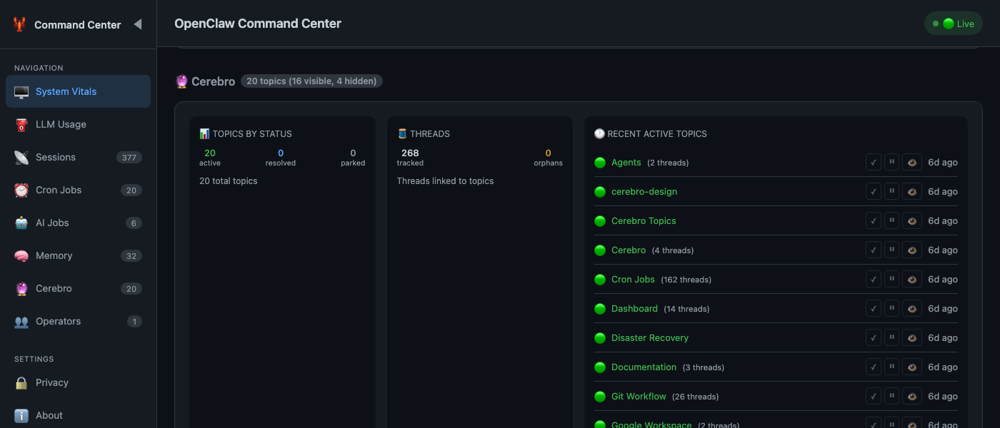
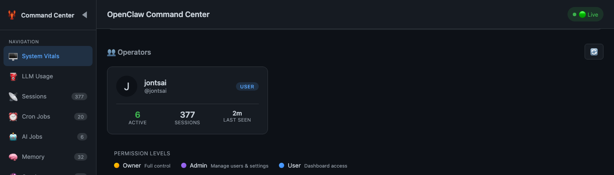
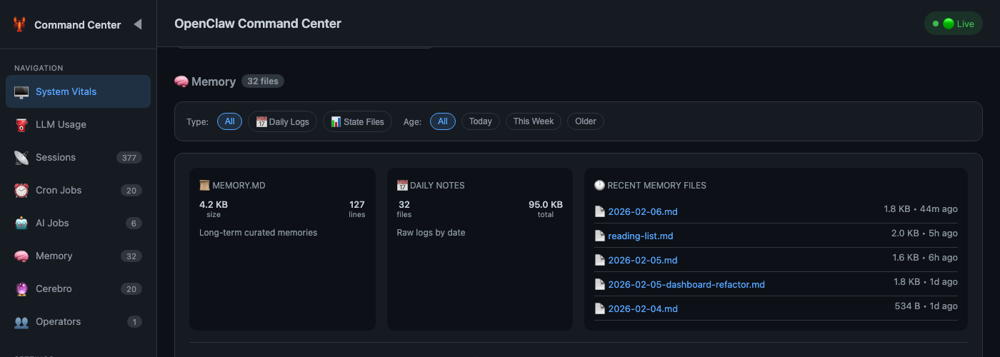
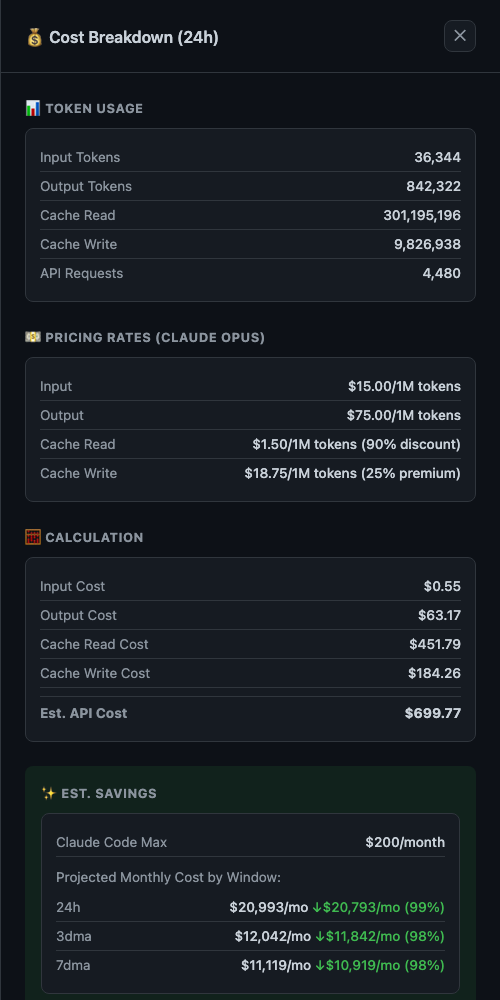
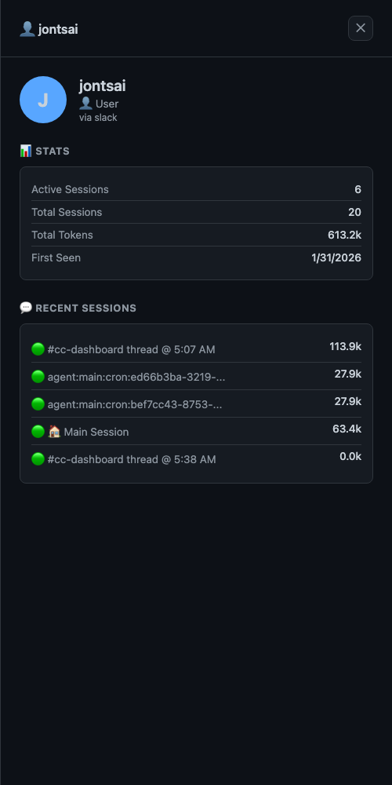
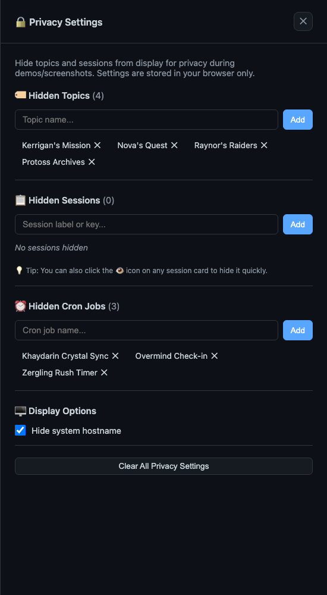
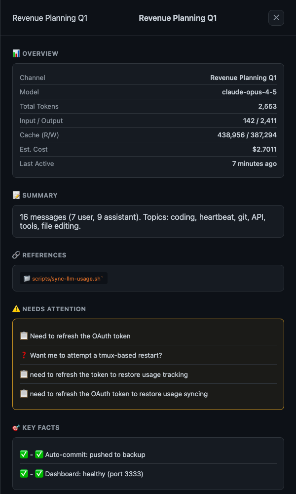

# 🦞 OpenClaw Command Center

[English](README.md) | 简体中文

<div align="center">

**你的 AI 代理任务指挥中心**

[](https://github.com/jontsai/openclaw-command-center/actions/workflows/ci.yml)
[](https://opensource.org/licenses/MIT)
[](https://nodejs.org)
[](https://www.clawhub.ai/jontsai/command-center)
[](https://github.com/jontsai/openclaw-command-center/pulls)

[功能特性](#功能特性) • [快速开始](#快速开始) • [安全](#-安全) • [配置](#配置)

</div>

---

## 为什么需要 Command Center？

你的 AI 代理 24/7 在运行，但你需要实时知道它们在做什么。

Command Center 为 OpenClaw 提供统一的可视化看板：**会话状态、Token/成本、系统健康、定时任务** 一屏掌握。

### ⚡ 快速

- **单次 API 聚合**：统一状态端点，而非 16+ 个分散请求
- **2 秒更新**：基于 SSE 实时推送，不依赖轮询
- **5 秒缓存**：高负载下保持后端响应
- **即开即用**：无需构建、无需编译

### 🪶 轻量

- **用户零依赖**：只需 Node.js
- **约 200KB**：看板 + 服务端总量小
- **无 webpack/vite/bundler**：直接运行
- **无 React/Vue/Angular**：原生 JavaScript（Vanilla JS），兼容性高

### 📱 自适应

- **桌面/移动端**：任意屏幕可用
- **深色主题**：长时间使用更舒适（Starcraft 风格）
- **实时更新**：无需手动刷新
- **离线友好**：支持优雅降级

### 🔧 现代

- **ES Modules**：组件化结构清晰
- **SSE 流式更新**：实时且高效
- **REST API**：可集成到你自己的工具链
- **TypeScript-ready**：附带 JSDoc 类型信息

### 🔒 安全（最重要）

| 特性              | 说明                                           |
| ----------------- | ---------------------------------------------- |
| **认证模式**      | Token、Tailscale、Cloudflare Access、IP 白名单 |
| **无外部调用**    | 本地 100% 运行：无遥测、无 CDN                 |
| **默认本机监听**  | 默认绑定 `127.0.0.1`                           |
| **默认只读**      | 先看后控，降低误操作风险                       |
| **UI 不暴露密钥** | API Key / Token 不在前端展示                   |
| **审计日志**      | 谁在何时访问了什么，一目了然                   |

```bash
# 安全部署示例（Tailscale）
DASHBOARD_AUTH_MODE=tailscale node lib/server.js
# 仅允许你 Tailscale 网络内用户访问
```

---

## 功能特性

| 功能                       | 说明                       |
| -------------------------- | -------------------------- |
| 📊 **会话监控**            | 实时查看活跃 AI 会话       |
| ⛽ **LLM 用量仪表**        | Token 用量、成本、剩余额度 |
| 💻 **系统状态**            | CPU、内存、磁盘、温度      |
| ⏰ **定时任务**            | 查看与管理 Cron Jobs       |
| 🧠 **Cerebro 话题**        | 自动话题聚类与追踪         |
| 👥 **Operators（操作者）** | 查看谁在与代理交互         |
| 📝 **记忆浏览**            | 浏览 memory 文件与状态     |
| 🔒 **隐私控制**            | 演示/截图时隐藏敏感内容    |
| 💰 **成本拆解**            | 模型维度成本明细           |
| 📈 **节省预测**            | 与人工估算做月度对比       |

---

## 快速开始

```bash
npx clawhub@latest install command-center
cd skills/command-center
node lib/server.js
```

**默认访问地址： http://localhost:3333** 🎉

<details>
<summary>备选：Git clone</summary>

```bash
git clone https://github.com/jontsai/openclaw-command-center
cd openclaw-command-center
node lib/server.js
```

</details>

---

## 零配置体验

Command Center 会自动探测 OpenClaw 工作区：

1. `$OPENCLAW_WORKSPACE` 环境变量
2. `~/.openclaw-workspace` 或 `~/openclaw-workspace`
3. 常见目录名：`~/molty`、`~/clawd`、`~/moltbot`

只要存在 `memory/` 或 `state/` 目录即可开箱使用。

---

## 配置

### 环境变量

| 变量                 | 说明                  | 默认值   |
| -------------------- | --------------------- | -------- |
| `PORT`               | 服务端口              | `3333`   |
| `OPENCLAW_WORKSPACE` | 工作区根目录          | 自动探测 |
| `OPENCLAW_PROFILE`   | 配置档名称（Profile） | （无）   |

### 🔒 认证模式

| 模式         | 适用场景       | 配置                                                      |
| ------------ | -------------- | --------------------------------------------------------- |
| `none`       | 本地开发       | `DASHBOARD_AUTH_MODE=none`                                |
| `token`      | API 访问       | `DASHBOARD_AUTH_MODE=token DASHBOARD_TOKEN=secret`        |
| `tailscale`  | 团队内网访问   | `DASHBOARD_AUTH_MODE=tailscale`                           |
| `cloudflare` | 公网部署       | `DASHBOARD_AUTH_MODE=cloudflare`                          |
| `allowlist`  | 固定 IP 白名单 | `DASHBOARD_AUTH_MODE=allowlist DASHBOARD_ALLOWED_IPS=...` |

### 📋 推荐的 OpenClaw 配置

#### Slack 线程能力（关键项）

```yaml
slack:
  capabilities:
    threading: all # all, dm, group, none
```

如果不启用线程，仪表盘对话题追踪能力会大幅下降。

#### 会话标签

```yaml
sessions:
  labelFormat: "{channel}:{topic}"
```

#### Cerebro（话题追踪）

```bash
mkdir -p ~/your-workspace/cerebro/topics
mkdir -p ~/your-workspace/cerebro/orphans
```

仪表盘会自动检测并展示对应数据。

---

## API

| Endpoint            | 说明                             |
| ------------------- | -------------------------------- |
| `GET /api/state`    | **统一状态接口**（看板核心数据） |
| `GET /api/health`   | 健康检查                         |
| `GET /api/vitals`   | 系统指标                         |
| `GET /api/sessions` | 活跃会话                         |
| `GET /api/events`   | SSE 实时流                       |

---

## 截图

### 看板总览

<p align="center">
  
</p>

### 会话面板

<p align="center">
  
</p>

### 定时任务面板

<p align="center">
  
</p>

### Cerebro 话题面板

<p align="center">
  
</p>

### Operators（操作者）面板

<p align="center">
  
</p>

### 记忆浏览面板

<p align="center">
  
</p>

### 成本拆解弹窗

<p align="center">
  
</p>

### Operator（操作者）详情

<p align="center">
  
</p>

### 隐私设置

<p align="center">
  
</p>

### 会话详情

<p align="center">
  
</p>

---

## 贡献

欢迎贡献，提交前请先阅读 [CONTRIBUTING.md](CONTRIBUTING.md)。

### 开发命令

```bash
npm install          # 安装开发依赖
npm run dev          # 监听模式
npm run lint         # 代码规范检查
npm run format       # 自动格式化
./scripts/verify.sh  # 健康检查
```

---

## License

MIT © [Jonathan Tsai](https://github.com/jontsai)

---

<div align="center">

**[Install from ClawHub](https://www.clawhub.ai/jontsai/command-center)** · **[OpenClaw](https://github.com/openclaw/openclaw)** · **[Discord](https://discord.gg/clawd)**

</div>
